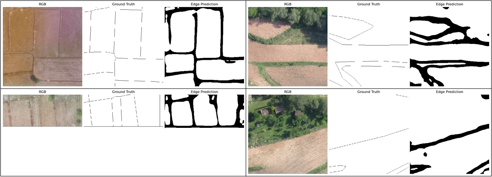
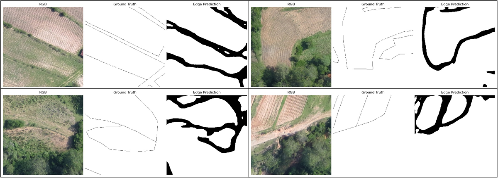
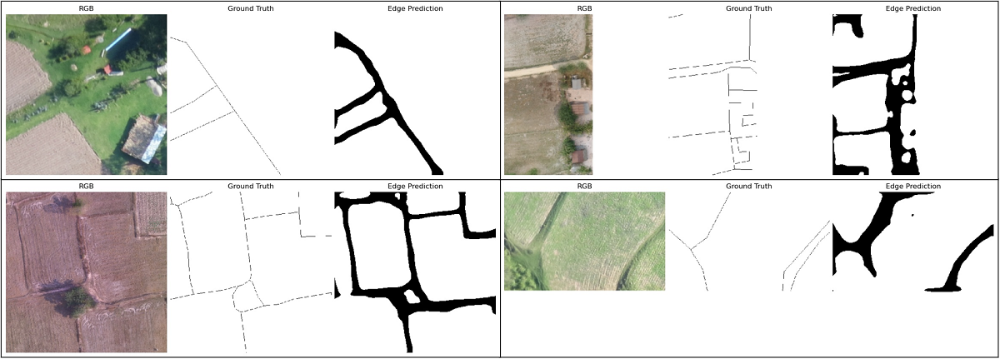

# Aerial Field Boundary Recognition Using HED

In this project, I leverage drone-captured images to detect field boundaries. Due to proprietary restrictions, the dataset is kept private.

### Training Model

- **Utilizing a blend of Holistically-Nested Edge Detection (HED) & UNET**

### Utilized Libraries and Frameworks

- Geospatial Data Management: **GDAL**
- Deep Learning Model Development: **PyTorch**
- Image Augmentations: **Albumentations**
- Tuning of Hyperparameters: **Optuna**
- Monitoring Model's Metrics: **MLflow**
- Image Processing and Display: **OpenCV** & **Matplotlib**

## Results
Despite the fact that our ground truth dataset was not flawlessly digitized, the model produced commendable predictions. Here are some representative results:

 
 

